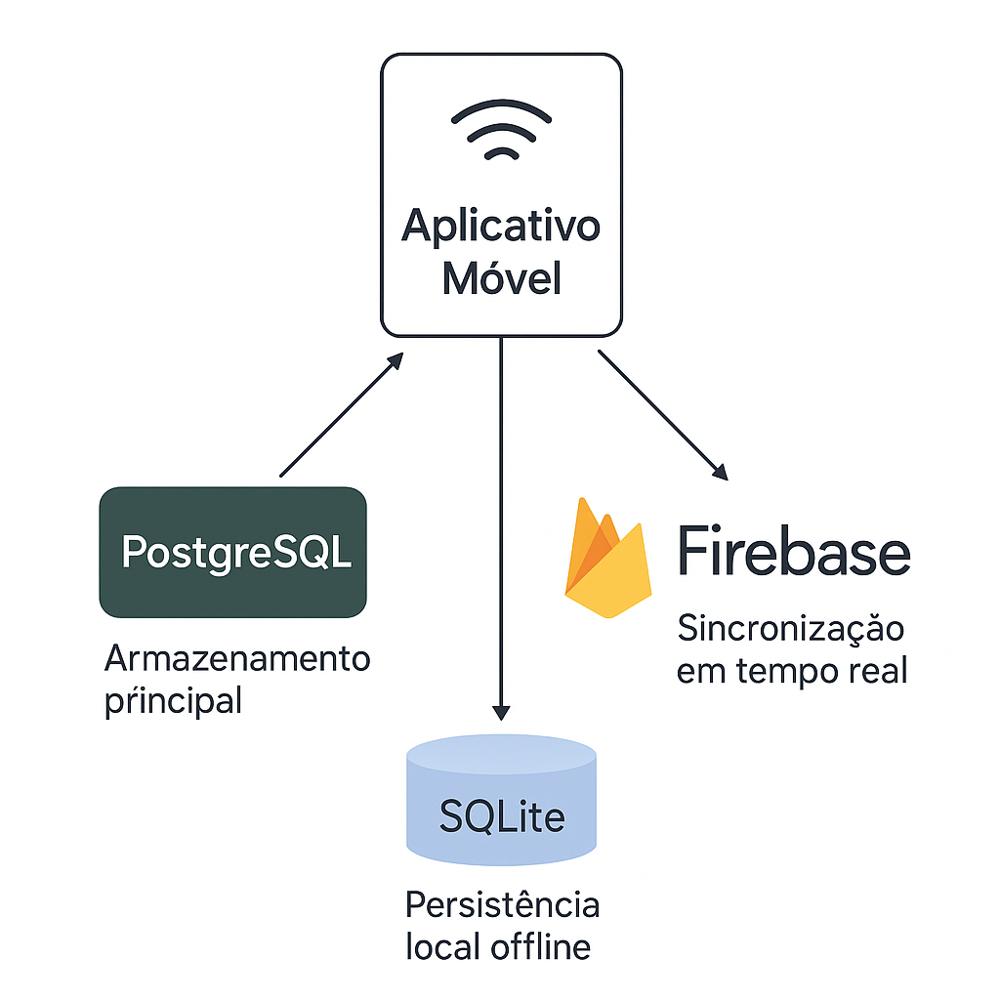

```
          +-------------------------+
          |                         |
          |   APP MOBILE (Flutter)  |
          |                         |
          +------------+------------+
                       |
                       |  SQLite (Local Storage)
                       |
          +------------v------------+
          |                         |
          |   Dados Locais/Cache    |
          |                         |
          +-------------------------+
                       |
                       | Sincronização
                       |
+---------------+      |      +------------------------+
|               |      |      |                        |
|  PostgreSQL   <------+----->  Firebase Realtime DB   |
|               |             |                        |
+---------------+             +------------------------+
 Dados Persistentes           Atualizações em Tempo Real
```

# Diagrama da Arquitetura Híbrida



# Diagrama Entidade-Relacionamento (PostgreSQL)

A estrutura do banco de dados PostgreSQL é a seguinte:

```
+----------------+       +----------------+       +-------------------+
|     Users      |       |     Alerts     |       |  TrustedContacts  |
+----------------+       +----------------+       +-------------------+
| PK Id          |---+   | PK Id          |       | PK Id             |
| Name           |   |   | FK UserId      |-------| FK UserId         |
| Email          |   +-->| Title          |       | Name              |
| Phone          |       | Description    |       | Phone             |
| DocumentId     |       | Latitude       |       | Email             |
| PinHash        |       | Longitude      |       | SendSms           |
| PinSalt        |       | CreatedAt      |       | SendEmail         |
| CreatedAt      |       | Status         |       | CreatedAt         |
| LastLogin      |       +----------------+       | IsActive          |
| IsActive       |                                +-------------------+
+----------------+
```

# Estrutura do Firebase Realtime Database

A estrutura do Firebase Realtime DB é organizada em coleções para otimizar sincronização e consultas em tempo real:

```json
{
  "users": {
    "user_id_1": {
      "name": "Nome do Usuário",
      "status": "online",
      "lastSeen": 1719683400000
    }
  },
  "active_alerts": {
    "alert_id_1": {
      "userId": "user_id_1",
      "title": "Emergência",
      "createdAt": 1719683400000,
      "latitude": -23.550520,
      "longitude": -46.633309,
      "status": "ACTIVE"
    }
  },
  "locations": {
    "user_id_1": {
      "latitude": -23.550520,
      "longitude": -46.633309,
      "accuracy": 10.5,
      "timestamp": 1719683400000
    }
  }
}
```

# Estrutura do SQLite Local

O banco de dados SQLite local contém as seguintes tabelas principais:

```sql
CREATE TABLE users (
  id TEXT PRIMARY KEY,
  name TEXT NOT NULL,
  email TEXT NOT NULL,
  phone TEXT NOT NULL,
  document_id TEXT NOT NULL,
  pin_hash TEXT NOT NULL,
  created_at INTEGER NOT NULL,
  last_login INTEGER,
  is_active INTEGER NOT NULL DEFAULT 1,
  is_synced INTEGER NOT NULL DEFAULT 0
);

CREATE TABLE alerts (
  id TEXT PRIMARY KEY,
  user_id TEXT NOT NULL,
  title TEXT NOT NULL,
  description TEXT,
  latitude REAL NOT NULL,
  longitude REAL NOT NULL,
  created_at INTEGER NOT NULL,
  status TEXT NOT NULL DEFAULT 'ACTIVE',
  is_synced INTEGER NOT NULL DEFAULT 0,
  FOREIGN KEY(user_id) REFERENCES users(id)
);

CREATE TABLE trusted_contacts (
  id TEXT PRIMARY KEY,
  user_id TEXT NOT NULL,
  name TEXT NOT NULL,
  phone TEXT NOT NULL,
  email TEXT,
  send_sms INTEGER NOT NULL DEFAULT 1,
  send_email INTEGER NOT NULL DEFAULT 0,
  created_at INTEGER NOT NULL,
  is_active INTEGER NOT NULL DEFAULT 1,
  is_synced INTEGER NOT NULL DEFAULT 0,
  FOREIGN KEY(user_id) REFERENCES users(id)
);

-- Índices para melhorar a performance
CREATE INDEX idx_alerts_user_id ON alerts(user_id);
CREATE INDEX idx_alerts_status ON alerts(status);
CREATE INDEX idx_trusted_contacts_user_id ON trusted_contacts(user_id);
```

# Estratégias de Sincronização

## Offline → Online

Quando o dispositivo volta a ficar online:

1. Identificar registros com `is_synced = 0`
2. Enviar esses dados para o Firebase Realtime DB para sincronização imediata
3. Posteriormente, os dados são consolidados no PostgreSQL pela API backend
4. Marcar registros como `is_synced = 1` após confirmação

## Conflitos de Sincronização

Para resolver conflitos de sincronização, a seguinte estratégia é utilizada:

1. Timestamp como prioridade principal (mais recente prevalece)
2. Em caso de timestamps similares, o servidor tem prioridade
3. Manter um log de conflitos para revisão quando necessário

# Considerações de Segurança

## PostgreSQL

- Conexão SSL obrigatória
- Firewall restringindo acesso apenas ao servidor de aplicação
- Autenticação por senha e certificado
- Backup diário com retenção de 30 dias

## Firebase

- Regras de segurança com autenticação obrigatória
- Validação de dados do lado do servidor
- Criptografia em trânsito e em repouso

## SQLite Local

- Criptografia do banco de dados local (SQLCipher)
- Armazenamento seguro da chave de criptografia
- Limpeza programada de dados sensíveis não utilizados
